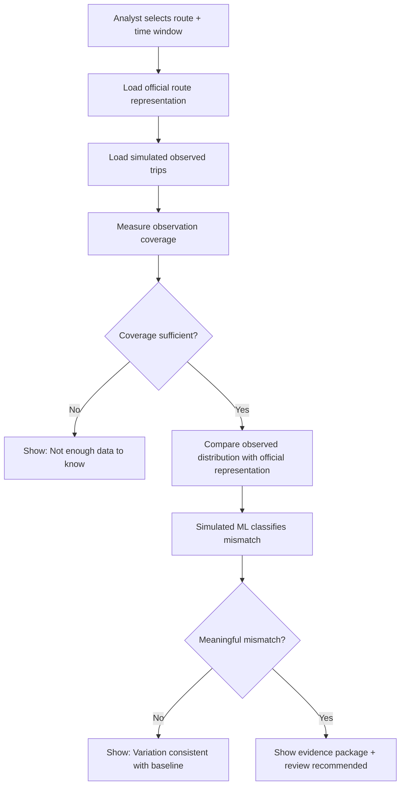
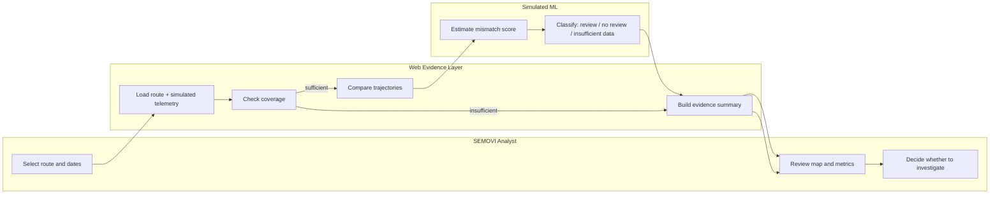

# Business Bending Week 07 — Operación CDMX

**Role:** TECHNOLOGIST  
**Working slice:** Representation-change evidence for concessioned transit  
**Vacuum status:** Hypothesis only — this build tests whether existing data has sufficient coverage to detect meaningful operational change and whether a signal can improve the current review workflow.

## 1. Problem in my own words

Mexico City already has route representations, mobility data, standards, and institutional update processes. The remaining question is narrower: **do existing observations provide enough coverage to distinguish normal operational variability from a meaningful mismatch between an official route representation and observed operation?**

This slice does not assume a technology vacuum. It creates a small evidence layer that compares a selected official route representation with simulated observed trips, checks whether the observation coverage is sufficient, and produces a clearly labeled review signal when the mismatch is large enough to merit human validation.

The system never updates an official route, sanctions a driver, identifies a person, or claims that a deviation is unsafe. It only produces evidence for review.

## 2. Exact user

**Primary user:** a SEMOVI mobility analyst reviewing route and service changes.

The analyst needs to answer one concrete question: **“Is there enough evidence that this route is operating differently from its current representation to justify review?”**

## 3. Success definition — before the module closes, X works

Before the module closes, an analyst can select a simulated CDMX route and time window, see the official route and observed trajectories on a map, see coverage and uncertainty, and receive a simulated-ML review signal that distinguishes **sufficient evidence for review** from **not enough data to know**.

The output is advisory only: **Potential representation mismatch — review recommended.**

## 4. AI-generated mockup

An AI-generated mockup is included with the submission as `docs/week7-mockup.png`. It shows the intended analyst dashboard: route selector, date range, official-vs-observed map, coverage metrics, mismatch confidence, and a review recommendation.

## 5. Flow + swimlane



### Swimlane



## 6. Benchmark line

**The best existing solution on Earth for this is:** Mobileye REM combined with established transit-data standards such as GTFS/GTFS-Realtime, because they already represent trajectories, infrastructure, and operational changes at large scale.

**Mine differs/localizes by:** testing the narrower question of whether a lightweight evidence layer can measure observation coverage and representation mismatch for Mexico City's concessioned transit before asking an institution to change its maintained representation.

## 7. Long view — 3 years

If this slice works, the full product becomes an evidence layer for continuously checking whether mobility representations still explain observed operations. In three years it could combine multiple authorized mobility signals, prioritize potentially safety-relevant mismatches, and create auditable review packages for agencies and operators. The product would remain a decision-support and evidence system, not an automatic authority over routes, drivers, or enforcement.

## 8. Scope cut — NOT building

- No ride-hailing app.
- No passenger navigation product.
- No autonomous-driving system.
- No automatic update of SEMOVI's official data.
- No driver surveillance or identification.
- No enforcement or sanctions.
- No real personal data.
- No real SEMOVI integration.
- No claim that every route deviation is unsafe.
- No unsourced claim that a technology vacuum already exists.

## 9. Architecture + stack

| Layer | Free technology | Purpose |
|---|---|---|
| Frontend | Next.js existing project + vanilla JS demo route | Analyst dashboard |
| Maps / geodata | Leaflet + OpenStreetMap tiles | Official and observed trajectories |
| ML | Simulated deterministic classifier in browser | Labeled proof-of-concept mismatch signal |
| Extra Dragon layer | Simulated phone/GPS telemetry | Observed trip points and coverage |
| Data | Local JSON-like constants | Fully invented, labeled demo data |
| Deployment | Existing Vercel project | Live URL when connected to GitHub |
| Version control | GitHub | Build evidence |

**Security:** no secrets, no real personal data, no authentication needed because the demo stores nothing personal. Inputs are constrained to predefined route/time options. All telemetry is invented and labeled simulated.

## 10. Data model

```text
Route
- id
- name
- officialPath[]
- officialStops[]

ObservationWindow
- routeId
- startDate
- endDate
- daysObserved
- tripsObserved
- uniqueVehiclesSimulated

ObservedTrip
- tripId
- routeId
- timestamp
- path[]
- source = simulated_phone_telemetry

AnalysisResult
- coverageLevel
- coverageScore
- mismatchScore
- confidence
- classification
- evidence[]
- recommendedAction
```

## 11. Test plan

### Mechanical pass

1. Open the Week 7 route.
2. Select the high-coverage / mismatch scenario.
3. Confirm official and observed paths render.
4. Confirm coverage metrics appear.
5. Confirm simulated ML label is visible.
6. Confirm review recommendation appears.
7. Select low-coverage scenario.
8. Confirm system refuses to overclaim and shows “Not enough data to know.”
9. Select no-change scenario.
10. Confirm no false review signal appears.

### Bug to find and fix

The first test pass intentionally checks the mobile map layout and the low-coverage state. The expected fix is to keep the coverage warning visible above the map and prevent the review CTA from appearing when coverage is insufficient.

### Persona test

Synthetic analyst persona: **Mariana, 43, SEMOVI mobility analyst.** She is comfortable with spreadsheets and maps, but distrusts black-box AI, skims dashboards quickly, and needs to know what evidence supports a recommendation.

Ask the persona to complete the route-review task from screenshots. Log hesitation around:
- what “coverage sufficient” means;
- whether the ML result is simulated;
- what the analyst is actually expected to decide;
- whether “review recommended” means the route is officially changed.

Fix the worst confusion before the final demo.

## 12. Falsification / kill condition

This slice is successful only if it produces evidence that could change the decision about building further. **Kill the technology hypothesis if existing institutional data and workflow already provide sufficient coverage and validation at equal or better time/cost, or if the signal does not improve a real review decision.**

The experiment is not designed to prove that a new mobility platform is needed. It is designed to find out whether one is needed.
